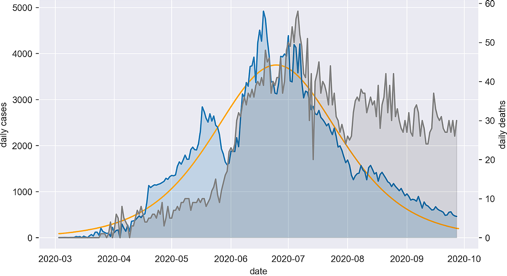

#Visualizing COVID in Saudi Arabia
There are many nice-looking visualizations online about the spread of COVID-19 in different countries, yet it's very hard to find any for Saudi Arabia. I decided to make some of my own plots in Python with a focus on Saudi Arabia and how it compares to other countries.

Below we have a graph of the total cases of COVID-19 in Saudi Arabia from the beginning of March till now.
The large black/blue dotted line shows the total reported cases over time and has accompanying numbers equivalent to values on the left vertical axis. 
The thin gray line shows the total deaths and uses values on the right vertical axis.
The orange dotted line is the closest approximation to the real values with an equation of the form 'ᴀ / ( 1 + ʙᶜ ⁻ ᵈᵃʸ )' also known as a logistic equation.

Another thing you can do is isolate the first 50 days where the data was more consistent to get a more accurate fit using an exponential function of the form 'ᴘ × ǫᵈᵃʸ + ʀ'.
From the equation, the value of Q you get shows the average percentage increase of cases per day. In this case, it shows an increase of 11% per day from the Q value of 1.11.

Here’s a graph showing daily new COVID-19 cases in blue, and daily deaths in gray.
The graph for deaths uses the values on the right vertical axis.
The gradient/increase-per-day of the fitted equation from plot #1 is shown in orange.
It’s interesting to note what looks like a rightwards shift of the gray graph relative to the blue graph. The difference in the position of the 2 peaks possibly shows that COVID-19 takes around 20 days to end in mortality.

This plot shows the journey of 100 different countries from when they reached 10,000 cases to 100 days later.
Each line represents a country, the beginning of each representing the first day it’s country reached more than 10,000 total cases.
The first 6 countries to reach 300,000 cases are highlighted and named and the thick black line represents Saudi Arabia.
Many countries shown don't have enough resources to accurately report case numbers so many of the lines end up much lower than they should be.

This plot is like the previous one but addresses the problem of countries not being able to accurately report cases by showing only a few notable first world countries from around the world, naming each one.

All the data used for these graphs is found at https://covid.ourworldindata.org/data/ecdc/full_data.csv
